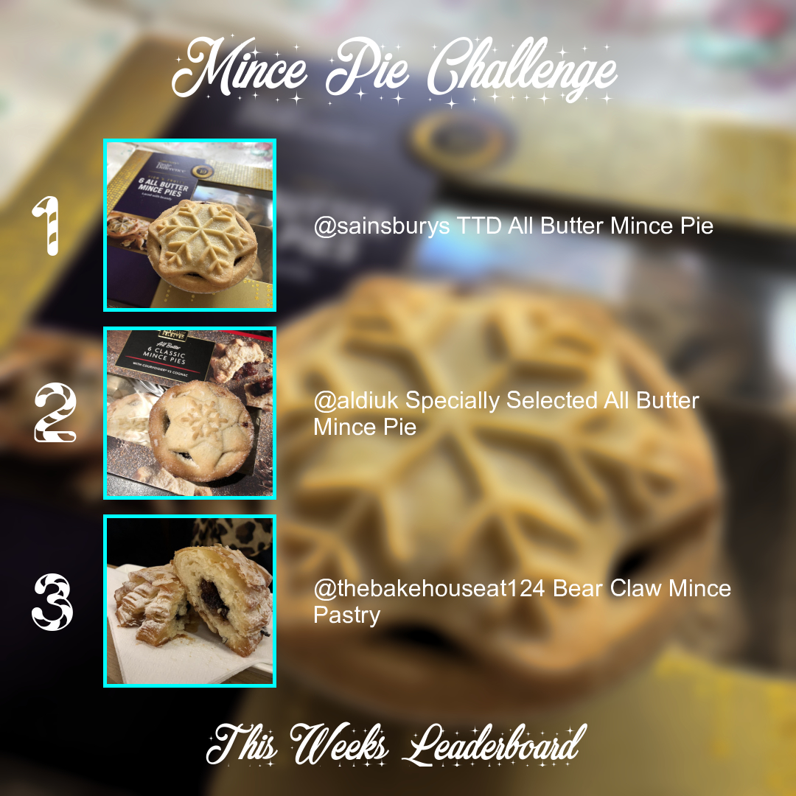

# 🥧 Mince Pie Challenge on Instagram

Crawls [@themincepiechallenge](https://www.instagram.com/themincepiechallenge/) for `#MincePie` posts and comment ratings (Pastry, Filling, Look, Value) using [Puppeteer](https://github.com/GoogleChrome/puppeteer).
It then scores these ratings and generates a weekly leaderboard image/caption for Instagram using [Jimp](https://www.npmjs.com/package/jimp).

